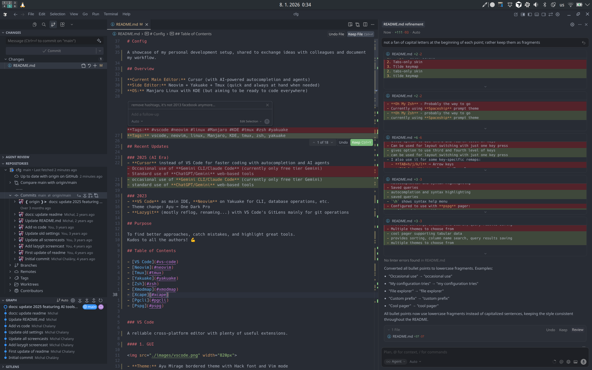
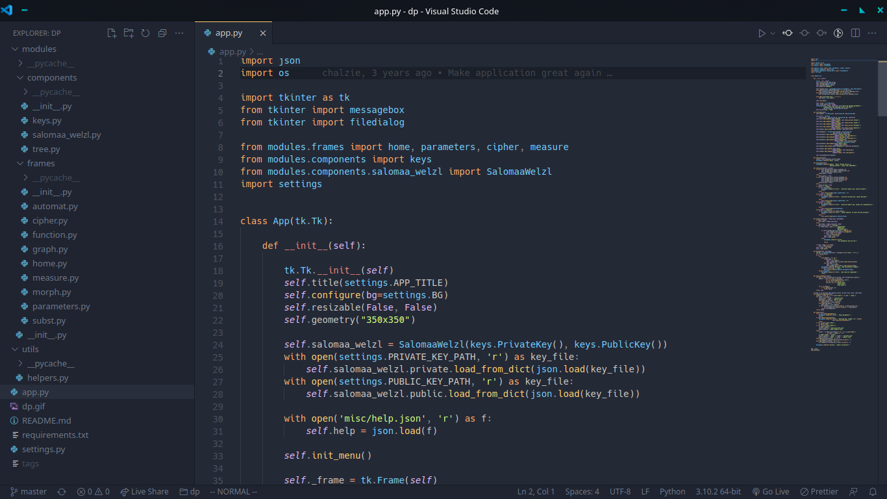
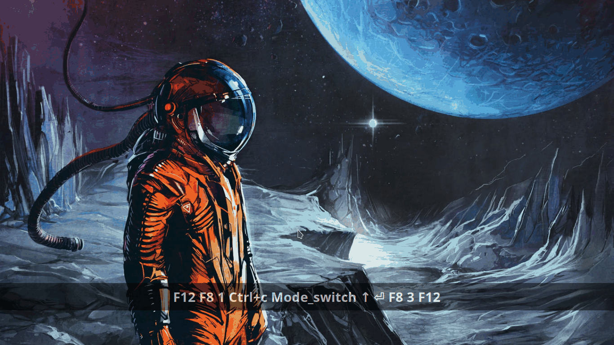

# Config

A showcase of my personal development setup, shared to exchange ideas with colleagues and document my workflow.

## Overview

**Current Main Editor:** Cursor (with AI-powered autocompletion and agents)  
**Side Editor:** Neovim + Yakuake + Tmux (quick and always at hand when needed)  
**OS:** Manjaro Linux with KDE (but aiming to be ready to code everywhere)  



**Tags:** vscode, neovim, linux, Manjaro, KDE, tmux, zsh, yakuake

## Recent Updates

### 2025 (AI Era)
- **Cursor** instead of VS Code for faster coding with autocompletion and AI agents
- occasional use of **Gemini CLI/Claude Code** (currently only free tier Gemini)
- standard use of **ChatGPT/Gemini** web-based tools

### 2023
- **VS Code** as main IDE, **Neovim** on Yakuake for CLI, database operations, etc.
- Theme change: Ayu → One Dark Pro
- **Lazygit** (mostly reflog, renaming...) with VS Code's GitLens mainly for git operations

## Purpose

To find better approaches, catch mistakes, and highlight great tools.
Kudos to all the authors! 💪

## Table of Contents

- [VS Code](#vs-code)
- [Neovim](#neovim)
- [Tmux](#tmux)
- [Yakuake](#yakuake)
- [Zsh](#zsh)
- [Xmodmap](#xmodmap)
- [Xcape](#xcape)
- [Pgcli](#pgcli)
- [Pspg](#pspg)


### VS Code

A reliable cross-platform editor with plenty of useful extensions.

#### 1. GUI



- **Theme:** Ayu Mirage bordered theme with Hack font and Vim mode

#### 2. Keymaps

- my configuration tries to replicate Neovim keymaps
- mainly to eliminate the need for mouse usage (ain't nobody got time for that)

#### 3. Terminal

- not really using the integrated terminal here
- only for **lazydocker** and **lazygit** (they are awesome and I got used to them)

#### 4. Interesting Extensions

- **Settings Sync** - backup of settings
- **Live Share** - collaborate with colleagues
- **Project Manager** - quickly switch between projects
- **Tailwind CSS IntelliSense** - tailwind CSS autocomplete

### Neovim

Not really a Vim fanatic, but I appreciate the efficiency gains. Every second saved counts! ⚡

#### 1. File Navigation

- **nvim-tree** - file explorer
- **Telescope** - fuzzy finder



#### 2. Syntax, Linter, Autocompletion

- **Treesitter** - syntax highlighting
- **nvim-cmp** - autocompletion


#### 3. Tags

- **Telescope** - tags list to jump between definitions
- **Aerial** - tags list to show file structure


#### 4. Git

- **Lazygit** via floaterm plugin


- **DiffView** - for revision diffing and current changes


#### 5. Docker

- **Lazydocker** via floaterm plugin


### Tmux

Sessions shall be managed, windows shall be created, panes shall be split...


**Keybindings:**
- custom prefix **F8** mapped to left **ALT**
- pane split: **ALT+h** (vertical), **ALT+l** (horizontal)
- pane switching: **ALT+hjkl**


### Yakuake

I like to have my terminal close at hand, like a console in many FPS games, hence Yakuake.

**Configuration:**
1. **Ayu** color scheme
2. tabs-only skin
3. tilde keymap


### Zsh

- **Oh My Zsh** - probably the way to go
- currently using **Spaceship** prompt theme

### Xmodmap

#### 1. CAPS Lock as CTRL

Common remapping for better ergonomics.

#### 2. Grave (Tilde) as Menu

Yakuake acts weird when mapped solely to the grave (tilde) key.

#### 3. TAB as Mode_switch

Might be unconventional, but it works for me.

- gives option to use third and fourth level of keys
- can be used for layout switching with just one key press
- I also use it for some key-specific remaps:
  - **TAB+h/j/k/l** → arrow keys
  - **TAB+&gt;/&lt;** → page up/page down
  - **TAB+q** → ASCII tilde (~)
  - **TAB+w** → backtick (\`)
  - **TAB+e** → euro symbol (€)

### [Xcape](https://github.com/alols/xcape)

#### 1. ESC on CAPS

Common remapping for Vim users.

#### 2. F8 on Left ALT

My tmux prefix. Also, **CTRL+ALT** now provides a nice overview of virtual desktops (KDE).

#### 3. TAB on TAB

Getting back the remapped default TAB behavior.

### [Pgcli](https://www.pgcli.com)

- CLI for PostgreSQL
- autocompletion and syntax highlighting
- saved queries
- `\h` shows syntax help menu
- configured to use with **pspg** pager:

```ini
pager = /usr/bin/pspg --rr=2 --quit-if-one-screen --ignore-case --pgcli-fix
```

### [Pspg](https://github.com/okbob/pspg)

- cool pager supporting tabular data
- provides sorting, column name search, query results saving
- multiple themes to choose from
