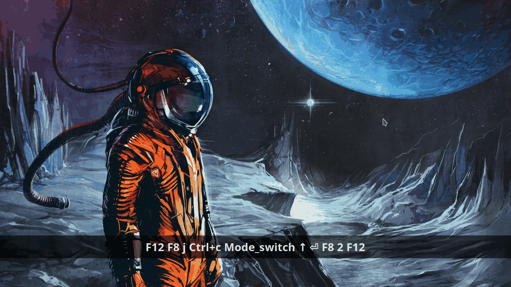

# Config (deprecated)

Showcase of my personal setup, to share and exchange with colleagues.  

Current main editor: VS Code (fan of a right tool for right job tho)  
Side editor: Neovim + Yakuake + Tmux -> quick and always at hand, when needed  
Current OS: Manjaro Linux with KDE (but aim to be ready to code everywhere)  
\#vscode \#neovim \#linux \#Manjaro \#KDE \#tmux \#zsh \#yakuake

~~to justify hours spent searching and adjusting setup~~  
~~to get better orientation in my bloated configuration~~  
:point_right: to find better approach, catch mistakes, highlight great tools  
(kudos to all authors :muscle:)

List of contents:

- vscode
- neovim
- tmux
- yakuake
- zsh
- xmodmap
- xcape
- pgcli
- pspg


### VS Code

- reliable cross platform editor with plenty of useful extensions  

1. GUI


- Ayu Mirage bordered theme with Hack font and Vim mode  

2. Keymaps

- basically, my config is just trying to copy keymaps from Neovim  
- mainly to, again, eliminate need for mouse (ain't nobody got time for that)  

3. Terminal  

- not really using the terminal here  
- only for lazydocker and lazygit (they are awesome and I got used to them)  

4. Interesting extensions  

- Settings Sync - backup of settings  
- Live Share - collaborate with colleagues  
- Project Manager - quickly switch between projects  
- Tailwind CSS IntelliSense - tailwind css autocomplete  

### Neovim

Not really a fanatic for VIM or anything, I just really like to spend the 1.8s of time I save everyday on something beneficial like spend it with my family... or with hookers snorting cocaine, whatever...

1. File navigation

- nvimtree
- telescope


2.  Syntax, linter, autocompletion

- treesitter
- nvim-cmp


3. Tags

- Telescope - tags list to jump between
- Aerial - tags list to show file structure


4. Git

- Lazygit via floaterm plugin


- DiffView - sometimes for revisions diffing, current changes


5. Docker

- Lazydocker via floaterm plugin



### Tmux

- sessions shall be managed, windows shall be created, panes shall be splitted...


- custom prefix F8 mapped on left ALT
- pane split on ALT and h(vertical), l(horizontal)
- panes switching via ALT+hjkl 


### Yakuake

I like to have my terminal close to me, like a console in many fps games, hence Yakuake.

1. ayu color scheme
2. tabs only skin
3. tilde keymap


### Zsh

- oh-my-zshell is probably the way to go
- currently using spaceship prompt theme

### Xmodmap

1. CAPS lock as CTRL - common stuff afaik

2. Grave as Menu - yakuake acts weird when mapped solely to grave

3. TAB as Mode_switch - might be weird, idk

- gives option to use third and fourth level of keys
- can be used for layout switching just for one key press
- I use it also for some key specific remaps:
  - TAB+h/j/k/l as arrows
  - TAB+&gt;/&lt; as pgup/pgdown
  - TAB+q as asciitilde (~)
  - TAB+w as backtick (\`)
  - TAB+e as euro symbol (€)

### [Xcape](https://github.com/alols/xcape)

1. ESC on CAPS - also common stuff afaik

2. F8 on left ALT - my tmux prefix, also CTRL+ALT now provides nice overview of virtual desktops (KDE)

3. TAB on TAB - getting back the remapped default TAB behaviour

### [Pgcli](https://www.pgcli.com)

- CLI for Postgres
- autocompletion and syntax highlighting
- saved queries
- \h shows syntax helping menu
- for me, to use with pspg pager:

```
pager = /usr/bin/pspg --rr=2 --quit-if-one-screen --ignore-case --pgcli-fix
```

### [Pspg](https://github.com/okbob/pspg)

- cool pager supporting tabular data
- provides sorting, column name search, query results saving
- multiple themes to choose
